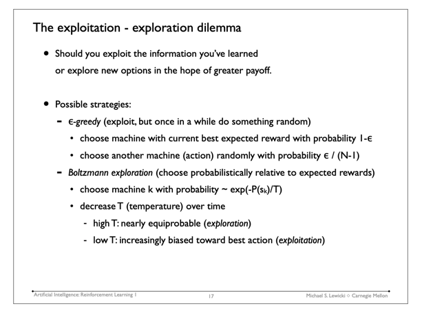

# Boltzmann Policy

## Questions

- What is `logits`?
- What is **boltzmann exploration**?
- How the `softmax` function work?
- Why divided the `logits` by `temperature`?
- Can we make an animation about the logic of the Boltzmann Policy?

### What is **boltzmann exploration**?

## References

- [Visualizing temperature in a Boltzmann policy](https://douglasrizzo.com.br/boltzmann-policy-temperature/)
- [Exploration Strategies in Deep Reinforcement Learning](https://lilianweng.github.io/lil-log/2020/06/07/exploration-strategies-in-deep-reinforcement-learning.html)
- [Artificial Intelligence: Representation and Problem Solving](https://www.cs.cmu.edu/afs/cs/academic/class/15381-s07/www/slides/050107reinforcementLearning1.pdf)